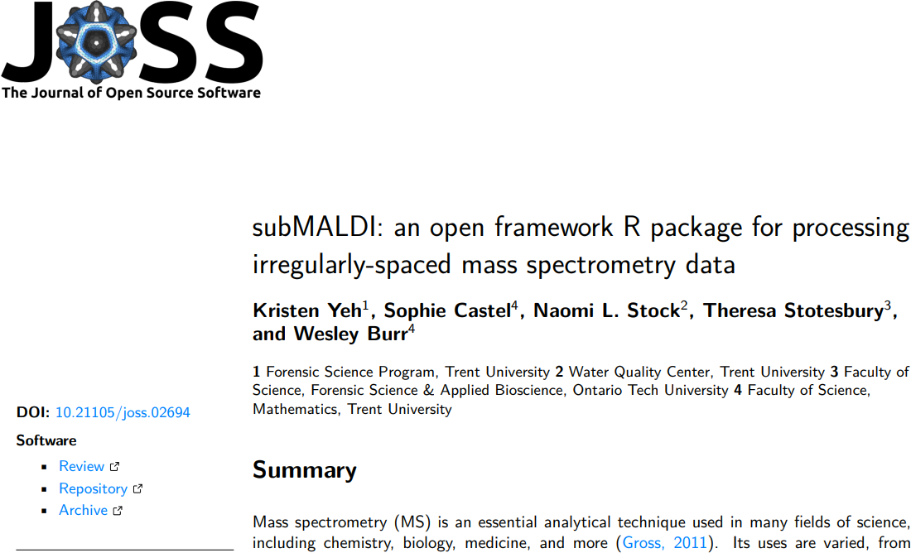

class: inverse

```{r include=FALSE}
library(ggplot2)
filter <- dplyr::filter
knitr::opts_chunk$set(warning=FALSE, message=FALSE, fig.width=10.5, fig.height=4, 
  comment=NA, rows.print=16)
theme_set(theme_gray(base_size = 24))
```

## What are Statisticians Good For?

In the case of chemistry ... it's often not clear! Many chemists still subscribe
to the Rutherford quote:

<br/>
&nbsp;
<br/>

<quote>
If your experiment needs statistics, you ought to have done a better experiment.
</quote>

---

class: inverse

## However ...

Once you get beyond bench experiments with limited observations, and enter
the world of *mass* spectroscopy, you start to get a **lot** of observations.
Each "observation" can be a run consisting of millions of events.

---

class: inverse

## Analysis?

So how do chemists analyze data from experiments using mass spectrometry instruments?

<br />
Typically, **closed-source software** provided by instrument manufacturers. For example:

<br/>

* Bruker provides **Flow Injection Analysis** and **SmartFormula algorithms** for their solariX line of FT-TOFMS machines
* LECO provides **ChromaTOF** and **StatCompare** for their Pegasus BT line of GCxGC MS
machines

---

class: analysis

## So What Do These Software Packages Do?

... that's a great question. 

<br/>

I'd like to discuss two different projects I've worked on, where we've implemented
entirely open-source solutions to specific workflows and tasks typical to the analysis
of data from machines such as the above. 

---

class: inverse

## subMALDI

Software originated from a 16-month collaboration with Kristen Yeh (now PhD candidate,
Toronto), Naomi Stock (Trent WQL) and Theresa Stotesbury (Ontario Tech, here today!)

<br />
First Problem (not my area): how does blood dry, and what are the chemical composition changes that occur over time as it does?

<br />
Second Problem (my area): How do we work with all this data?!

---

class: inverse

## subMALDI

Vague background - IANAC: I Am Not A Chemist ... although actually, maybe I should say
IANAEE, although I am ... sort-of.

<br />
Laser agitates a surface (in this case, dried cow blood) on a plate; the resulting 
aerosol is run through a magnetron, ionized, and then spun in a cyclotron. The ions
arriving at plates are counted, and in the end, you have millions (possibly) of
ions counted for each particular mass. Result is a mass spectra.

---

class: inverse

## The Data

So the result is a pair of vectors: the mass, and the counts corresponding to that mass. 
The files are fairly "small" - only a few million pairs. 

<br />
Unfortunately, the data is exported as a comma-separated character string. So a few 
MB actually corresponds to a tremendously large data set, despite being stored in ASCII.

<br />
**Solution**: train a student (Kristen), develop an R package - completely open-source - 
do the analysis (paper), and release the software for free use and re-use on GitHub (paper).


---

class: center

## $\;$

<center>

</center>

---

class: center

## So What Does the Package Do?

<center>

</center>

---

class: center

## So What Does the Package Do?

<center>

</center>

---

class: center

## So What Does the Package Do?

<center>

</center>

---

class: center

## So What Does the Package Do?

<center>

</center>

---

class: inverse

## Musings

* closed-source has the potential for very high polish

--

* closed-source is ... closed

--

* it's your data, you should have access to it (not always an issue - just in this case)

--

* allows for easy implementation of cutting-edge techniques

--

* what's your objective?

---

class: top

## Second Project

The second project is ongoing / less polished, but much more involved. 

<br />

The issue: LECO sold UQTR (Shari Forbes' forensic taphonomy lab) a Pegasus BT, but 
StatCompare hadn't been updated to support the data from it. And this state of
affairs continued for multiple years. 

<br />

Several PhD students had hundreds of GCxGC data sets, observed after painstaking work,
and aside from basic visualization and peak detection, couldn't **do** much with it.

---

class: inverse

## The Data Options

There were two options for the data export: 

<br/>

* CDF/NetCDF of the (raw?) outputs from the machine

--

* semi-processed peak 'hit lists' after comparison with standard peak databases, such
as the NIST option

---

class: inverse

## The Issue

Processing a single high-resolution NetCDF file is possible. With care, effort, and 
some specific software.

<br />
Doing this processing on hundreds of NetCDF files, each of which is ~ 1GB in size? Not
so much.

<br />
Doing this with off-the-shelf software? As far as I've been able to tell: simply not 
possible. 

---

class: inverse

## Second Issue

Writing software is had. Writing user-friendly software is harder. 

<br />

Whatever I implemented had to be usable by students who were running out of time to 
complete their PhD dissertations. They'd already done years of experimentation, and 
now the data analysis part of the work was in limbo.

---

class: inverse

## Solution

I'm most familiar with the R programming language; secondarily comfortable with Fortran
and C++. Passingly familiar with MATLAB and Python. 

--

<br />
Whatever I implemented had to be able to run. The files were huge, the process was 
lengthy and involved. So the students needed access to computational power to run
the created software on.

--

<br/>

This led me to choose R. Primary reason? I have a functioning high-powered RStudio Server
running at Trent which I could provide them access to, allowing for easy collaboration,
and for remote debugging (both students were at UQTR)

---

class: inverse

## gcgcWork

So what is the package? At the moment, it is a pipeline for data in a specific
format coming from LECO's ChromaTOF. This consists of 4-9 steps depending on the
analysis desire. The primary steps are:

--

* a variation of the cross-sample alignment procedure implemented in StatCompare
    - note: the documentation for this is very poor
    
--

* organizing the set of samples; variable mutation

--

* normalization against a reference standard

--

* cleanup; removal of peaks which are not properly mapped

--

* custom coincidence logic across samples; preparation for PCA

---

class: inverse

## gcgcWork

So why is this necessary?

* most open-source software is designed to work with one (or maybe two) samples - mass spectra

--

* most chemists just use the provided software, or write custom scripts in MATLAB or equivalent to do some basic things

--

* custom steps almost always require custom software

--

* closed-source alignment procedures are fraught with potential confounding - there's no control over what is actually happening in the process

---

class: inverse

## Guinea^^^^^^ Collaborator

Dr. Darshil Patel (then PhD candidate) completed the full pipeline with my 
assistance as part of his PhD
dissertation work, for two different data sets gathered at a morgue, and 
at the REST[ES] facility.

--

We were building the train
while it hurtled down the tracks, on fire and possibly loaded with nitroglycerin.

--

<br/>

* 9 donors

--

* 140+ experimental (GCxGC) 'samples'

--

* over 30,000 uniquely identified compounds across hundreds of thousands of peaks

--

* approximately 160 hours of computer use (20 cores going flat-out for that whole time)


---

class: inverse

## Musings

* it's certainly possible to write open-source software that can do ... well, basically 
anything!

--

* duplicating the effect of a closed-source piece of software is heavily dependent on
the documentation being complete, which is almost never true

--

* if we want our results to be reproducible, depending on a specific version of a specific
piece of software is only marginally acceptable, **if** that software can be audited

--

* many other communities are almost entirely open-source: chemistry and mass spectrometry
are quite behind in this respect

---

class: inverse

## Some Take-Aways

* if you have computational skills, there's a big world of science out there that can 
use your help

--

* if you have statistics skills, the same is true, possibly more-so

--

* every time we can successfully create an open-source workflow that replaces or
complements a closed-source, we move science forward

--

* there's a desperate need for more collaboration across disciplines to build teams
that can do this kind of work


---

layout: false
class: inverse, middle

<center>
<a href="http://www.trentu.ca/math/"></a> &emsp;&emsp;
<a href="https://creativecommons.org/licenses/by/4.0/"></a>
</center>

## With thanks to all of my collaborators on these projects: Theresa Stotesbury, Naomi Stock, and Shari Forbes; and students Kristen Yeh, Sophie Castel, Darshil Patel and Rushali Dargan. 

- Contact me: [Email](mailto:wesleyburr@trentu.ca)
- Slides created via the R package [xaringan](https://github.com/yihui/xaringan) by Yihui Xie
- Slides and source at <http://bit.ly/ammcs2023>
